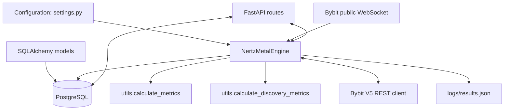
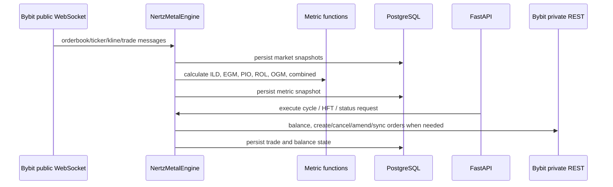
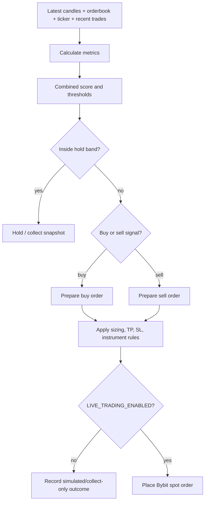
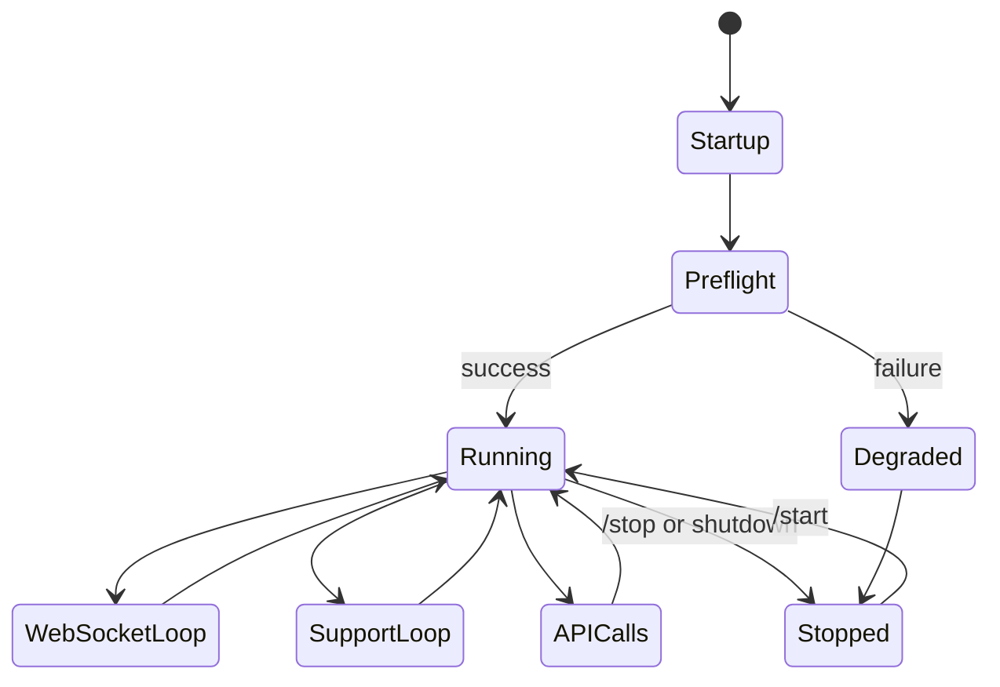

# Architecture Overview

NerTzh is organized around one runtime engine, `NertzMetalEngine`, exposed through a FastAPI application. The engine maintains in-memory market state, persists snapshots to PostgreSQL, calls Bybit private REST endpoints when credentials are available, and computes trading metrics from the latest market data.

## System Layers

## Execution Pipeline

## Decision Flow

## Runtime Lifecycle

## Memory And State

- In-memory market state: `orderbook_data`, `ticker_data`, `candles`, `recent_trades`.
- Runtime task state: WebSocket start task, support loop task, HFT tasks per symbol, order sync lock.
- Persistent state: SQLAlchemy models in `src/models.py`.
- JSON event log: `logs/results.json` via helpers in `src/utils.py`.
- Optional ML state: in-process model dictionaries in `NertzMetalEngine`.

## Monitoring And Validation

The `/validation` endpoint checks four operational layers:

- Process: running flag, start task, support loop, WebSocket state.
- Market data: recent orderbook, ticker, and kline timestamps per symbol.
- Database: pending trade and tracked order ID counts.
- Orders: Bybit open orders, linked orders, and potential bot-created orphan orders.

## Known Architecture TODOs

- TODO: add persistent ML artifacts if ML becomes part of the release story.
- TODO: add automated architecture tests or route schema snapshot tests.
- TODO: document exact WebSocket subscription topics after final review.
